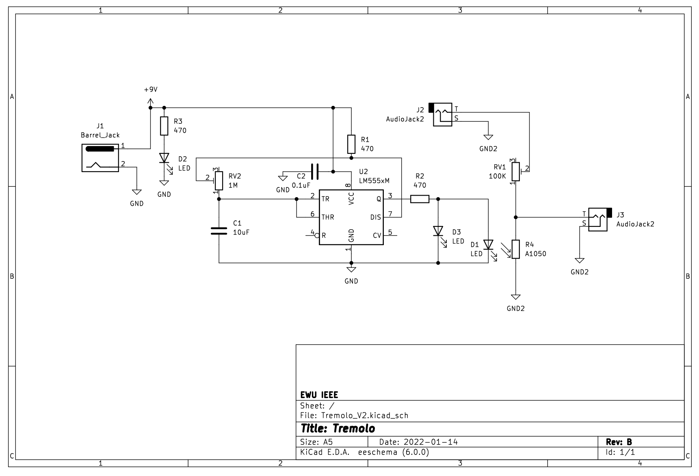
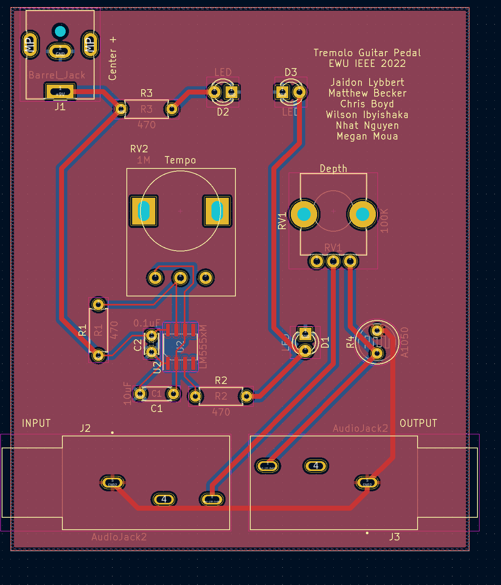
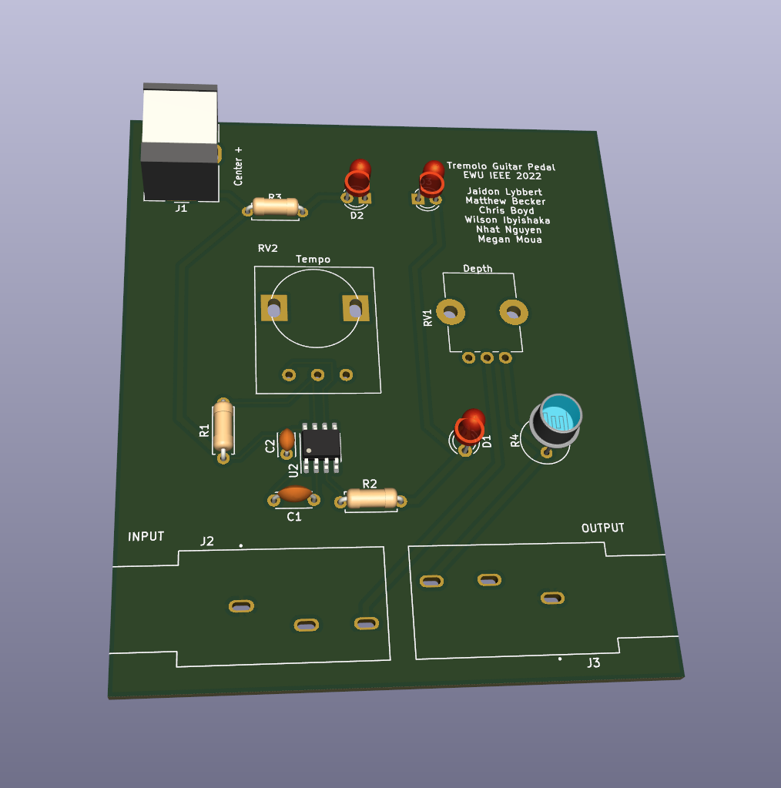
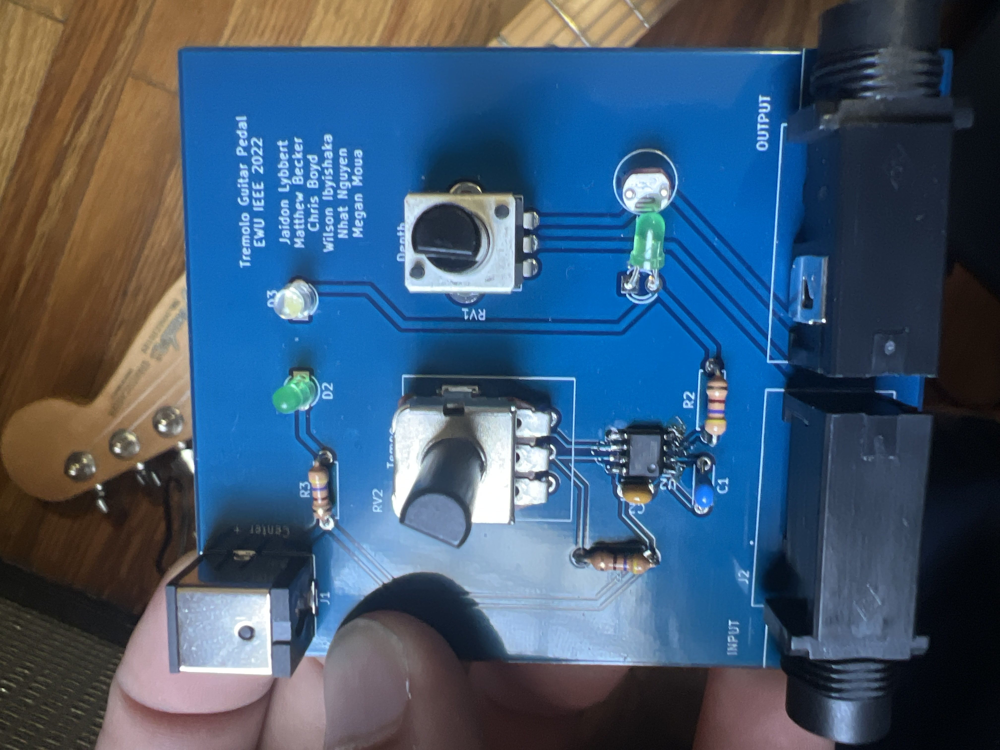
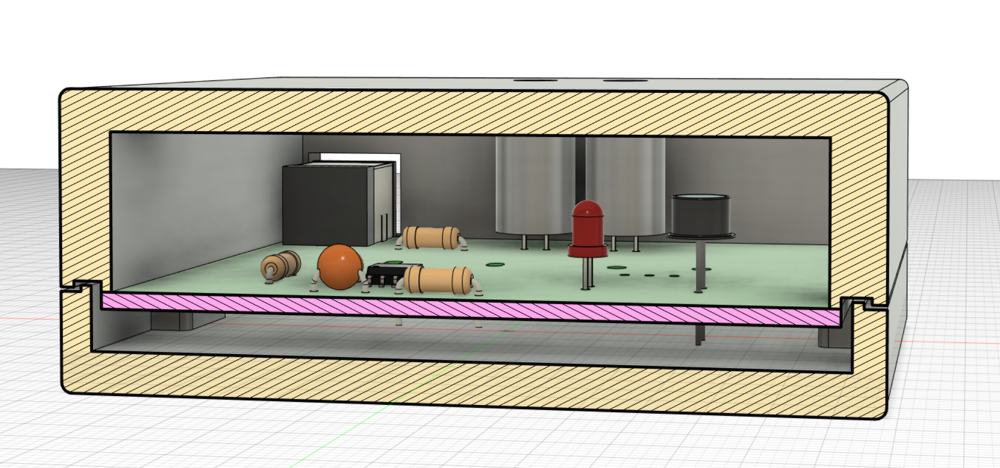

=======
Tremolo
=======

The Tremolo implements the tremolo effect. The design is a revision of the one here: https://www.instructables.com/Make-Your-Own-Tremolo-Effects-Pedal/

Schematic
---------

PCB Layout
----------

Finished Board
--------------

Cross Section of Enclosure CAD
------------------------------

Sound Bytes
-----------

.. raw:: html

    <audio controls src="_static/soundbyte_mp3.mp3">
      Your browser does not support the <code>audio</code> element.
    </audio>

Project materials
-----------------

** To be added **
