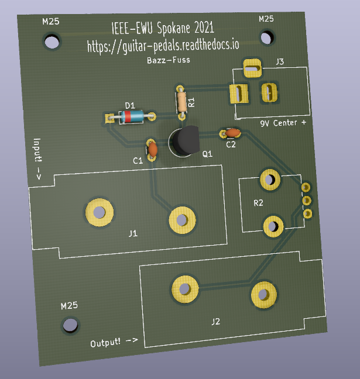

===============
Getting Started
===============

This is the Guitar Pedals **Getting started** page.

Right now, we have one pedal design ready to go! It's the Bazz-Fuss.

Project materials
-----------------

* 2 x Female 1/4 TRS Audio Jack | Digikey: 2223-MJ-63022A-ND
* 1 x 100k Potentiometer 	| Digikey: PTV09A-4015F-B104-ND
* 1 x 2N3904 NPN Transistor     | Digikey: 2368-2N3904-ND
* 1 x 100k Resistor             | Digikey: BC3447CT-ND
* 1 x 0.1 uF Capacitor          | Digikey: 399-C318C104K5R5TACT-ND
* 1 x 4.7 uF Capacitor          | Digikey: 445-FK26X7R1C475KR000-ND
* 1 x 1N914 Diode   		| Digikey: 2197-1N914-ND
* 1 x Barrel Jack 		| Digikey: CP-002A-ND
